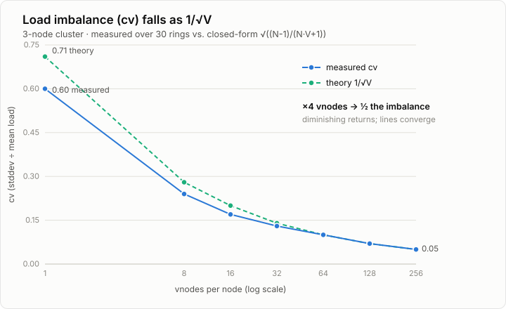

# experiments

A scratch repo for small, self-contained code snippets I'm fiddling with. Each
experiment stands alone — no shared framework, just runnable examples.

## Stack

Java 23 · Gradle 9.3 (wrapper) · JUnit 5 · Guava.

## Build & run

```bash
./gradlew build          # compile + test
./gradlew test           # tests only
./gradlew run            # run the default experiment
```

`run` launches `org.experiments.hashing.ConsistentHashing` by default. Point it at any
other experiment's `main` with:

```bash
./gradlew run -PmainClass=org.experiments.OtherExperiment
```

## Experiments

### `org.experiments.hashing.ConsistentHashing`

Explores how a consistent-hashing ring behaves as you vary the number of virtual
nodes (vnodes) per physical node. Two parts:

1. **fixed-partition routing** — `hash(key) mod N`, the naive approach whose
   ownership is upended whenever `N` changes.
2. **consistent-hash ring** — a `TreeMap`-backed ring (Murmur3-128 hashing) with
   configurable vnodes per node.

Part 2 sweeps vnodes from 1 to 256 and, over 30 randomized rings, reports these
signals when a 4th node joins a 3-node cluster (10k keys):

- **movement** — the fraction of keys that relocate. The average sits near the
  theoretical 25% regardless of vnodes (it's set by node count), but the
  **spread** between best- and worst-case rings shrinks sharply as vnodes rise.
- **imbalance** — the busiest node's key count relative to its fair share
  (`busiest load ÷ average load`). The intuitive "how hot is the hottest node"
  number: it falls from ~1.76x at 1 vnode to ~1.06x at 256.
- **cv** — the coefficient of variation of the per-node load
  (`stddev ÷ average`). A scale-free measure of *overall* balance across all
  nodes, not just the worst one. It falls from ~0.60 to ~0.05.

After the sweep it prints a summary table comparing the measured `cv` against the
closed-form prediction `√((N-1)/(N·V+1))` (N nodes, V vnodes each):

```
┌────────────────────────────┬─────────┬──────────┬───────────┬───────────┬───────────┬────────────┬────────────┐
│                            │ 1 vnode │ 8 vnodes │ 16 vnodes │ 32 vnodes │ 64 vnodes │ 128 vnodes │ 256 vnodes │
├────────────────────────────┼─────────┼──────────┼───────────┼───────────┼───────────┼────────────┼────────────┤
│ imbalance (busiest node)   │ 1.76x   │ 1.30x    │ 1.20x     │ 1.16x     │ 1.12x     │ 1.08x      │ 1.06x      │
│ cv (whole distribution)    │ 0.60    │ 0.24     │ 0.17      │ 0.13      │ 0.10      │ 0.07       │ 0.05       │
│ cv theory  √((N-1)/(NV+1)) │ 0.71    │ 0.28     │ 0.20      │ 0.14      │ 0.10      │ 0.07       │ 0.05       │
└────────────────────────────┴─────────┴──────────┴───────────┴───────────┴───────────┴────────────┴────────────┘
```

**Takeaway:** load balance improves as `1/√vnodes` — to *halve* the imbalance you
must *quadruple* the vnodes. Since each vnode is a ring entry (memory + lookup
cost), production systems settle around 100–256 vnodes and stop. Measured `cv`
tracks the theory, running slightly under at low vnode counts (an artifact of
averaging a square root — see below).



#### Why `cv ≈ √((N-1)/(N·V+1))`

(`√` is the square-root sign; the entire fraction sits under the root.)

A node's load is its share of the ring's circumference. With `V` vnodes it owns
not one arc but `V` scattered arcs, so its load is a **sum of `V` independent
random pieces**. Averaging `V` independent draws keeps the mean fixed (the fair
share, `1/N`) but shrinks the spread around it in proportion to `1/√V` — the same
square-root law behind "a poll of 4× as many people is only 2× more accurate."
That `1/√V` is the whole shape of the curve; everything else is a correction:

- **`N-1`** on top: the `N` node loads must sum to 1, so they're slightly coupled
  (one node being large forces others smaller). Negligible once `N` is large.
- **`+1`** in the denominator: a small finite-size term that only nudges the
  tiny-`V` end.

**Why the measured `cv` runs *under* theory at low vnodes.** The program averages
`√variance` across the 30 trials, and `√` is concave, so by Jensen's inequality
the average lands *below* the closed form. At low `V` the trial-to-trial variance
swings hard and the gap shows (0.60 vs 0.71); at high `V` every trial is nearly
identical, the gap vanishes, and the two rows converge.

### `org.experiments.cache` — LRU cache

An O(1) LRU cache: a `HashMap` for lookup plus an intrusive doubly-linked list
(sentinel head/tail) for recency order — most-recently-used at the tail, the
eviction victim at `head.next`. `LRUCache` is the single-threaded core;
`LRUCacheThreadSafe` extends it and guards `get`/`put` with a `ReentrantLock`.

Two design points worth calling out:

- **`get` is a mutation.** A hit moves the entry to the front, so the thread-safe
  variant needs an *exclusive* lock. Reaching for a read/write lock's read side on
  `get` would be a bug — two concurrent hits both rewrite the list.
- **`null` values are rejected** (`Objects.requireNonNull` in `put`), so a `null`
  from `get` unambiguously means "absent" rather than "present but null."

Then the same idea is pushed toward how real hyperscale caches actually work — a
progression from *correct* to *concurrent*:

- **`StripedLRUCache`** — N independently-locked shards routed by hashed key (the
  `ConcurrentHashMap` lock-striping trick). Cuts contention ~N×, at the cost of
  per-shard (non-global) eviction order.
- **`RedisSampledLRUCache`** — Redis's `maxmemory-policy allkeys-lru`. Reads only
  stamp a timestamp (no list mutation → **lock-free reads**); eviction samples K
  random entries and drops the oldest. Approximate, but reads never contend.
- **`CaffeineCache`** — a thin adapter over Caffeine (W-TinyLFU), the production
  answer the other two approximate.

This experiment has no `main` — it's exercised by tests:

```bash
./gradlew test
```

The exact-LRU behavioral tests are parameterized over `LRUCache` /
`LRUCacheThreadSafe` (so the thread-safe subclass is proven observationally
identical), plus concurrency tests that hammer them from 16 threads to catch a
broken lock. The approximate caches can't be tested by exact eviction order, so
`ApproximateCacheTest` asserts **invariants** (size stays bounded, no corruption
under a thread storm) and **statistics** (a hot set survives eviction; a larger
sample size retains it better) — the right way to test an approximate structure.
